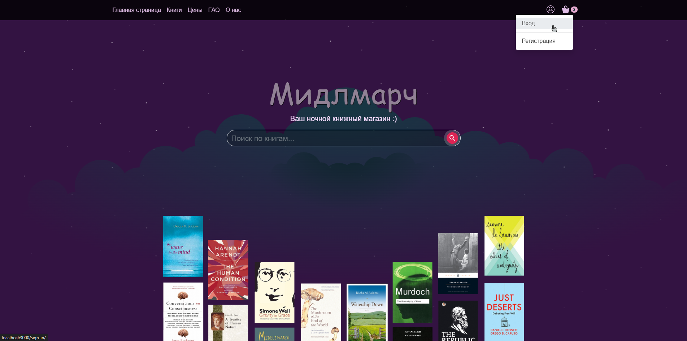
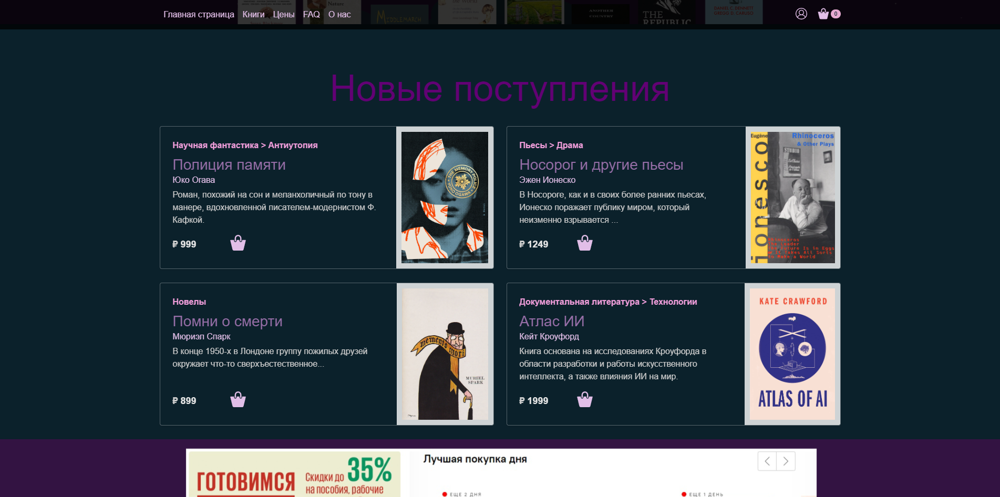
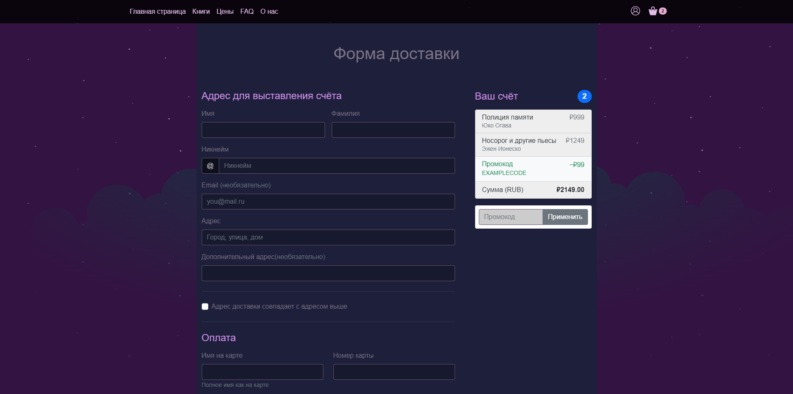
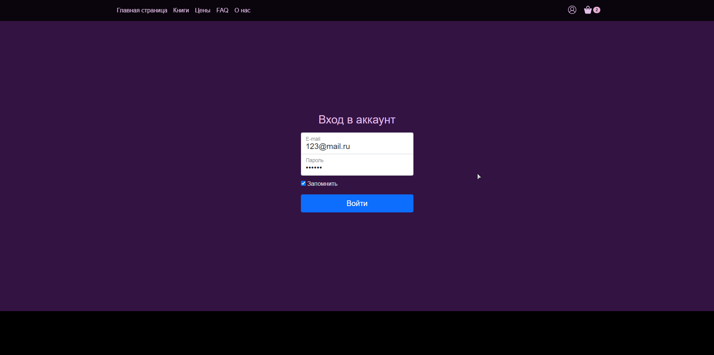

# Лабораторная работа №4
## SPA-приложение на vue.js

### Инструкция по запуску проекта:
1) Убедиться в наличии интернет-соединения
2) Сделать git clone репозитория
3) С помощью терминала воспользоваться командой 
"npm run dev" - произойдет запуск локального сервера.

